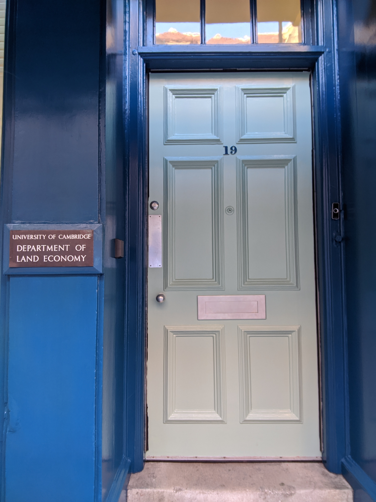

## Real Estate Research Seminars

As we are collectively embracing online meetings... Shall we come together for regular real estate research seminars? First Thursday of the month, 4-5 pm UK time?

This initiative is still very malleable. Others are working on similar ideas and we should be able to find a good setup that works for most of us. Let's get the ball rolling and work out organisational details along the way? In the end, a good seminar is nothing but an interesting paper meeting a good audience.

Do get in contact if you would like to present, attend or help organising. 

### The setup

This is up for debate, but my suggestion would be

- The seminars should be short and interactive: 20-25 minutes for speaker (with few questions during presentation). Questions will be colleceted during the presentation in a text chat. 25 minutes of questions and discussion. 
- A moderator will (try to) keep things orderly, civil and on track.
- This is open to academics and researchers from all over the world.
- We won't record the seminars. Presenters don't need to be afraid that preliminary results or comments will remain online forever.
- Junior researchers and students are very welcome. 
- Papers should be developed enough to be worth discussing - but not overcooked. Ideally, feedback should still be meaningful.

### Infrastructure

Probably ZOOM Webinars? 
Those who register (below) will receive an email invitation with a link to the virtual seminar room.

### Schedule

**The very first seminar on April 2nd, 2020, 4-5 pm UK time**

### Registration

If you would like to present or participate, please sign up for  **[Registration form for participants and presenters](https://forms.gle/dEXQicjaLnHRB9Nr5)**

### Support or Contact

Thies Lindenthal, [email](mailto:htl24@cam.ac.uk) or [DM on twitter](https://twitter.com/thieslindenthal)

